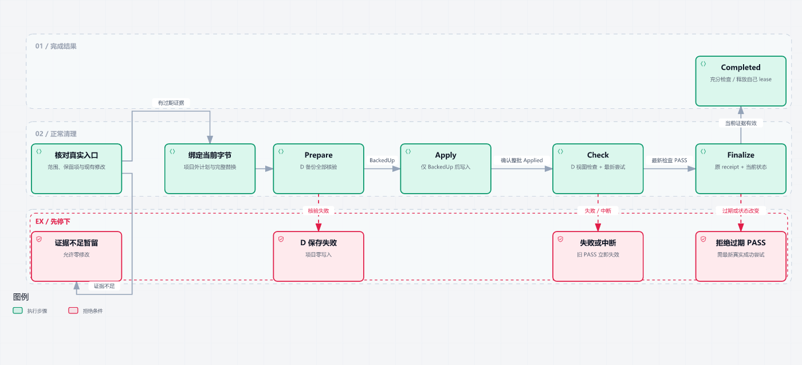
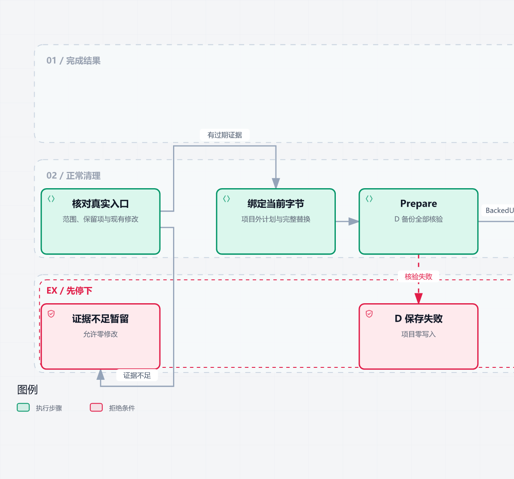
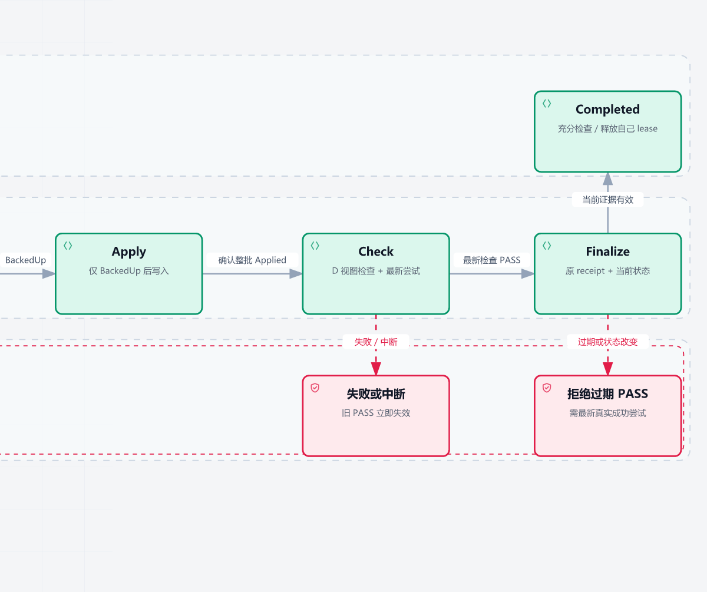
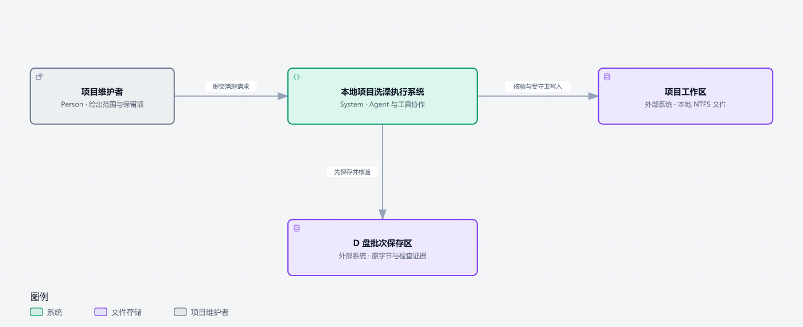
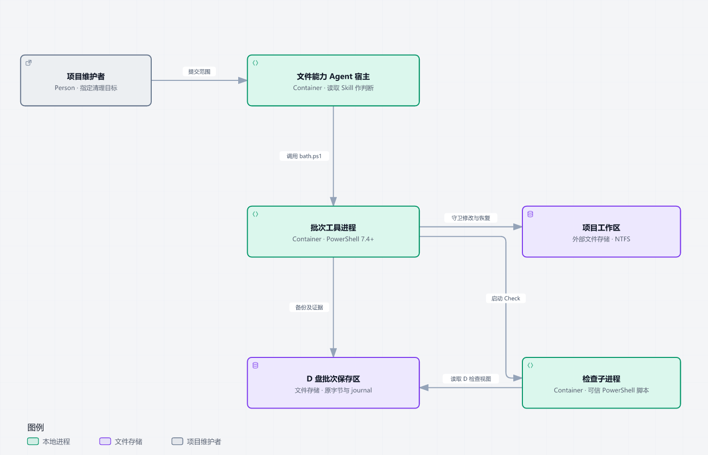
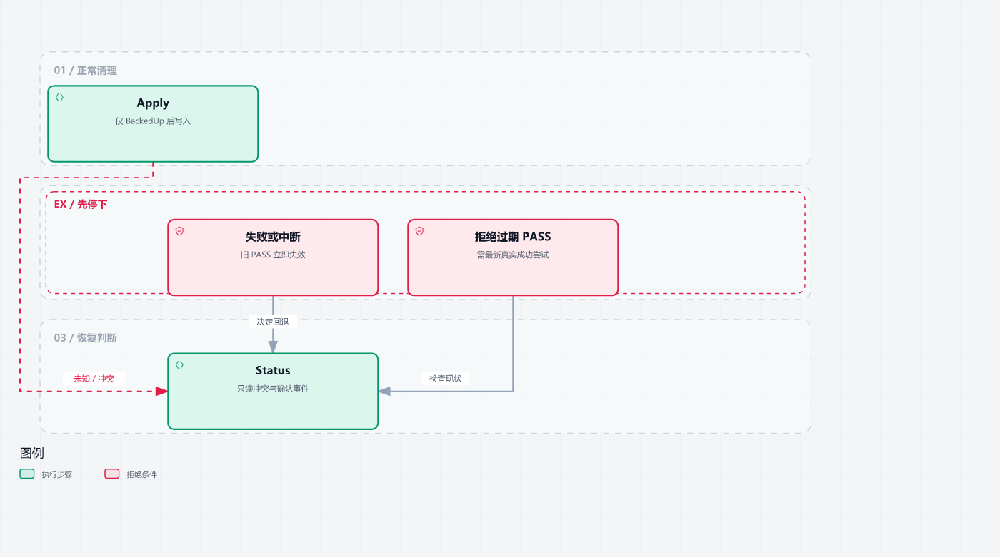
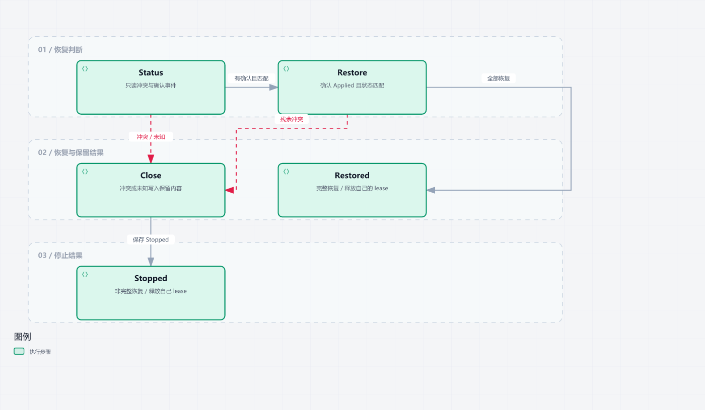

<h1 align="center">project-bath</h1>

<p align="center">给文件型编码 Agent 一套项目清理方法：先确认为什么能改，再保存原字节，最后检查、完成或保留冲突。</p>

<p align="center"></p>

旧说明已经被替代，却仍在影响 Agent；目录换了名字，启动配置还指着旧路径；清理完才发现需要找回文件。project-bath 把这些维护任务变成有范围、有检查、有退路的小批次操作。

你提供项目目录、清理目标、保留项和可用检查。Agent 判断哪些内容确实失效，工具保存修改目标的原字节并保护恢复过程。你得到清理后的项目、检查结果和集中放在 D 盘的可回取备份。证据不足时可以零修改。

## 本页导航

[如何清理](#workflow) · [能做什么](#capabilities) · [安装](#install) · [快速开始](#quick-start) · [系统架构](#architecture) · [恢复与故障处理](#recovery) · [适用边界](#limits) · [许可证](#license)

<a name="workflow"></a>
## 如何清理：先保存，再修改



一轮清理从真实入口和替代关系开始，不从文件年龄或搜索次数开始。准备好项目外的计划、完整替换文件和检查脚本后，按以下顺序执行：

1. **Prepare** 保存并回读核验全部修改目标的原字节；返回 `BackedUp` 后才允许写入。备份失败，项目保持原样。
2. **Apply** 按冻结的计划执行，并记录实际操作的确认事件。关联文件共用一个项目批次占用，目录更名与引用同步属于同一批。
3. **Check** 在保留的 D 盘检查副本上运行你提供的检查。每次新尝试都会使更早的 PASS 失去完成依据；失败或中断不能拿旧结果交差。
4. **Finalize** 重新核对当前文件状态及最新成功收据，记录 `Completed` 并释放自己的批次占用。检查是否足够、清理是否保留业务行为，仍由 Agent 和维护者判断。

下面两张细节图与上方总览是同一个流程，便于在普通阅读宽度看清条件；备份确认后由左半段衔接右半段的 Apply。





[下载交互流程图](assets/diagrams/workflow-normal.html) · [可编辑流程数据](assets/diagrams/workflow-normal.json)。HTML 可下载后用本地浏览器打开；GitHub README 内只显示静态预览，本次没有在线交互站点。

<a name="capabilities"></a>
## 能做什么

| 你遇到的问题 | 可以进行的操作 | 得到什么 |
|---|---|---|
| 旧说明或规则已被当前入口替代 | 核对证据后归档普通文件，或完整替换其内容 | 原字节先存入 D 盘；项目里留下当前有效内容 |
| 多个配置必须一起同步 | 使用关联文件批次编辑、归档多个目标 | 全部目标先备份再开始写入；逐项确认，保留安全恢复路径 |
| 目录更名会牵动启动引用 | 同一父目录下更名一次目录，并同步关联文件 | 工具计算更名前后路径；关联文件可全部位于目录外 |
| 项目有大量依赖或缓存 | 明确检查输入、带理由的排除项和允许输出 | 不必复制整个环境；排除的依赖行为不算验证通过 |
| 检查之后用户又改了文件 | 拒绝旧收据完成和冲突恢复覆盖 | 后续用户内容与原备份都保留，状态如实交接 |
| 操作中断或恢复不确定 | 先 Status，再选择 Restore 或安全停止 | 持久记录帮助识别确认过的操作，不凭字节相同猜测成功 |

日期旧、零文本引用、名字相似都不等于过期。动态加载入口和仍有效的规范应暂留。这是维护 Skill，适合迭代结束、发布前整理和上下文降噪；普通功能开发、架构重构与仅解释工具不触发清理。

**与普通备份、直接 shell 清理的区别：** 普通备份留下副本；shell 提供删改命令。project-bath 还把清理证据、当前字节绑定、先保存后写入、操作确认、最新检查和冲突保留组织成可交接的流程。它不自动证明一个文件在业务上已经没用。

<a name="install"></a>
## 安装：只装运行包，不把展示素材装进 Agent

当前版本为 **v0.2.0-rc2**（Release Candidate）。本页的功能、安装步骤和示例均对应这一版本。

运行要求为 **Windows、PowerShell 7.4+、本地固定 NTFS**，并需要可写的 `D:/project-bath`。本次实际运行使用 Windows 与 PowerShell 7.6.5；Linux/macOS 未验证、当前也不支持。PowerShell 自带所需 .NET；使用工具不需要 Python、Node.js 或 npm。

[下载 RC2 运行包](https://raw.githubusercontent.com/SHlTbro/project-bath/v0.2.0-rc2/distributions/project-bath-v0.2.0-rc2.zip)。它保留该版本原始 ZIP 字节。解压后是一个 `project-bath` 目录，必须保留这些路径：

| 安装内容 | 职责 |
|---|---|
| `SKILL.md` | 触发条件、证据判断与操作顺序 |
| `references/protocol.md` | 按需读取的计划、检查和恢复协议 |
| `scripts/bath.ps1` | 日常唯一工具入口 |
| `scripts/bath-group.ps1` | 关联文件和更名联动批次 |
| `scripts/bath-scope.ps1`、`bath-preview.ps1`、`bath-view.ps1` | 范围预检、输入选择和保留检查视图 |
| `scripts/bath-rename.ps1` | 更名核验的复用组件；不作为日常独立入口 |
| `references/LICENSE` | 原安装包中的 `MIT` 许可证，不是执行依赖 |

**最直接的使用方式：** 在一个新的普通本地目录解压运行包，让能读文件、执行 PowerShell 的 Agent 读取其 `SKILL.md`。图片、交互 HTML、演示文件和 Git 元数据都不是 Agent 运行依赖。宿主的自动发现目录各不相同；不要同时把两个同名 Skill 放进自动发现范围。

包含 `examples` 的完整本地展示目录还提供一个已验证的隔离安装助手。打开本展示根目录的 PowerShell，运行：

```powershell
pwsh -NoProfile -File examples/check-environment.ps1
pwsh -NoProfile -File examples/install-preview.ps1 -Destination ./preview-install
pwsh -NoProfile -File ./preview-install/project-bath/scripts/bath.ps1 -Action Help
```

`preview-install` 必须不存在。助手核对原始 ZIP，解压到新目录，只规范自己新复制的运行文件属性，不修改现有 Skill 或目标项目。输出会给出完整 Skill 入口；让 Agent 读取该入口即可。若你只下载运行 ZIP，没有展示目录，可直接解压并使用包内入口。

包内 `candidate` 标签描述预览渠道；历史“未安装”文字不代表你的机器当前未安装。以实际入口文件和调用结果核对版本，不为调整这类文字改动冻结包。

<a name="quick-start"></a>
## 快速开始：先跑一次可回取的清理

以下命令适用于包含 `examples` 的完整展示目录；在其根目录运行：

```powershell
pwsh -NoProfile -File examples/first-cleanup.ps1
```

示例会在同一磁盘根部创建唯一的 `bath-test-showcase-*` 一次性目录，准备两份明确互相建立替代关系的说明，只归档旧的一份。它实际执行 Prepare、Apply、Check、Finalize、Status、历史 Restore，并核对恢复后的原字节。不会清理你的现有项目，也不会删除示例或 D 盘失败证据。

已实测的结果摘要：

```json
{
  "prepare": "BackedUp",
  "apply": "Applied",
  "check_passed": true,
  "finalize": "Completed",
  "restore": "Restored",
  "original_bytes_preserved": true
}
```

这证明工具闭环能执行，不代表任何真实项目里的旧文件都可以删除。真实任务从下面这样的请求开始（将目录换成你的项目实际绝对路径）：

```text
读取已安装的 project-bath Skill。只整理 <项目绝对路径> 中的过时说明：
先核对当前入口与替代关系，保留有效规则、动态入口和已有用户修改。
将证据充分的旧说明集中归档到 D:/project-bath；检查覆盖本次风险。
实际修改经工具完成，最终交接变化、未验证项、批次状态和恢复位置。
```

另外两类常用任务：

- **更名与同步：**“将项目里的 `old-agent` 更名为 `study-agent`，同时核对并同步启动配置和文档引用；仅同父目录更名，先保存全部关联目标。”Agent 用更名联动计划，文件 `path` 写更名前路径，工具计算 `path_after`。
- **只读审计：**“只审计旧规则和未引用文件，核对动态入口；证据不足暂留，暂时不要改。”这时允许零修改，不需要为了完成任务强建修改批次。

### 工具入口与范围

日常通过同一 `scripts/bath.ps1` 调用。单文件使用 schema 1；关联文件使用 schema 2，更名联动使用 schema 4，后两者加 `-Group`。计划、替换和检查脚本放在项目外，原字节 hash 来自当前工作区，不来自 Git HEAD。

```powershell
# 以下变量由你的 Agent 从真实项目和本批计划确定：
# $tool：bath.ps1 绝对路径；$project：项目根；$plan/$scope：项目外文件。
pwsh -NoProfile -File $tool -Group -Action Prepare -Root $project -Plan $plan -Scope $scope
# 必须使用 Prepare 返回的 batch，完整备份成功后才 Apply：
pwsh -NoProfile -File $tool -Group -Action Apply -Root $project -Batch $batch
pwsh -NoProfile -File $tool -Group -Action Check -Root $project -Batch $batch -CheckScript $checker
pwsh -NoProfile -File $tool -Group -Action Finalize -Root $project -Batch $batch -Receipt $receipt
```

这些变量化命令是接口说明；上方 `first-cleanup.ps1` 是可直接运行、含实际输入与检查的完整示例。不要复制一个 PASS 布尔值冒充工具原始检查收据。

Scope 冻结输入、排除原因、检查副本可写输出和资源预算。例如检查不依赖虚拟环境时，可以由 Agent 明确写入：

```json
{"schema_version":1,"inputs":["."],"excluded":[{"path":".venv","reason":"本次说明与配置检查不执行环境内依赖"}],"outputs":[],"limits":{"max_files":0}}
```

`max_files` 默认或为 `0` 时没有文件数量上限；这不取消其他资源预算。检查脚本必须用 `ViewRoot` 找副本，缓存和报告只写声明的 `outputs`。排除代表不复制、不验证，不能称相关依赖已经通过。

<a name="architecture"></a>
## 系统架构与技术栈

### 系统边界：本地 Agent 与工具协作



维护者给出范围和保留项；Agent 读取 Skill、判断证据并生成计划；工具核验后访问项目工作区和 D 盘保存区。文件存储图形表示本地 NTFS 文件系统，不是数据库服务或云平台。

### 运行进程：判断与保护分工



Agent 宿主负责语义判断。PowerShell 工具进程负责计划绑定、文件状态核对、备份和操作记录；检查子进程在 D 盘副本执行维护者提供的脚本。`SKILL.md` 是加载的方法，scope/group/rename 是复用模块，没有被虚构成单独服务。

| 技术 | 在这里承担的职责 |
|---|---|
| Markdown + YAML 元数据 | 让文件型 Agent 发现并按需加载清理方法和协议 |
| PowerShell 7.4+ | 统一 CLI、计划解析、批次协调、启动检查进程 |
| .NET / C# 内联类型 | 通过文件句柄读取、比较、写入和核验；复用系统密码学 hash |
| Windows / NTFS API | 查询身份、父目录及时间；无覆盖更名、CreateNew 恢复与复杂对象拒绝 |
| JSON / JSONL | 保存计划、manifest、检查收据和逐步确认；进程退出后仍可回查 |
| D 盘文件系统 | 集中保存目标原字节、替换内容、目录清单与保留的检查副本 |

[本地交互上下文](assets/diagrams/c4-context.html) · [本地交互进程图](assets/diagrams/c4-containers.html) · [C4 可编辑上下文源](assets/diagrams/c4-context.mmd) · [C4 可编辑进程源](assets/diagrams/c4-containers.mmd)。上述 C4 文件与 Archify 数据可用于进一步理解，核心关系已在本页解释。

<a name="recovery"></a>
## 恢复与故障处理



进程突然退出后先 Status。工具读取持久意图和确认事件，区分已确认的操作与未知写入；文件看起来相同也不能替代确认。新 Check 失败或中断后，旧 PASS 失效，需新的实际成功检查才能完成。



有自身确认并且当前状态匹配，才能 Restore。更名联动批次先逆序恢复文件，再核验完整目录内容、身份与路径，最后逆转目录；任何残余冲突都会阻止目录逆转。

| 情况 | 怎么处理 |
|---|---|
| Prepare 保存或核验失败 | 保留项目原件与失败证据；修复原因再开始。单文件无完整 manifest 的准备失败可 Cancel；关联批次用允许的 Close |
| 检查失败、收据过期、检查后文件变化 | 不 Finalize 旧 PASS；先 Status，选择新的有效检查或安全恢复 |
| 原名出现新文件、用户后来编辑、确认事件不完整 | 不覆盖、不自动合并；先 Status，能安全恢复的项可恢复，无法确认时 Close 保留现场 |
| Completed 后想撤回 | 使用历史 Restore；另一个批次占用项目时会拒绝，不抢别人的 lease |
| 想正常结束健康批次 | 用 Finalize 或 Restore；Close 不是跳过检查/恢复的通行证 |

可给 Agent 的恢复请求：

```text
核对这批次的 Status 和原始 D 备份。只恢复自身已确认且当前匹配的项；
不覆盖同名新文件或用户后续修改。不确定时保留现场并按协议 Close，
说明哪些已经恢复、哪些仍有冲突，别把 Stopped 说成全部恢复。
```

备份统一放在 `D:/project-bath/<项目名-根标识>/<唯一批次>/`。单文件的 `before.bin`，关联文件的 `entries/<entry_id>/before.bin` 是实际原字节；manifest 保存原路径。更名目录的其他子项仅保存完整 namespace 清单与身份核验证据，**不等于整棵目录的文件字节备份**。归档恢复要求原名空闲，用户内容始终优先保留。

[下载中断判断图](assets/diagrams/workflow-interruption.html) · [中断数据](assets/diagrams/workflow-interruption.json) · [下载恢复图](assets/diagrams/workflow-recovery.html) · [恢复数据](assets/diagrams/workflow-recovery.json)。

<a name="limits"></a>
## 适用边界与常见问题

- 当前只支持本地 Windows / 固定 NTFS 普通对象。拒绝 hardlink、ADS、reparse、自定义 ACL、特殊文件属性及超过当前路径长度限制的对象；不改项目原件属性来凑通过。`NotContentIndexed` 也可能触发拒绝。
- 默认仍有目录、字节和时间预算：512 个目录、单文件 16 MiB、总计 64 MiB、30 秒。可声明的硬上限为 100000 个目录、总计 1 GiB、300 秒；单文件仍最多 16 MiB。
- 更名仅支持同父目录的一次普通子目录更名，必须附至少一个关联文件操作。多目录事务、跨父目录、仅大小写更名、自动冲突合并均不支持。
- 锁与 lease 协调工具调用，不阻止所有宿主写入。Agent 仍有直接 shell 权限，守约调用是 best-effort；不能宣称全宿主不可绕过。
- 检查副本不是 OS 沙箱。依赖原卷、原绝对路径、原 ACL 或外部可写服务的检查不适用；未覆盖的行为明确列为未验证。
- 保证范围是当前检查的证据绑定与拒绝危险覆盖，不是业务绝对正确、无限资源或 OOM 安全。恢复原字节不承诺重建所有时间与所有权元数据。

**为什么有大量文件也仍可能被拒绝？** 文件数量上限已取消，但其他资源预算和文件形态仍受限。先依据本次风险选择 Scope，不把排除后的空检查当成全项目通过。

**为什么恢复拒绝覆盖明明“同名”的文件？** 名字相同不代表同一对象。字节、身份、写入时间或操作确认变化，都可能说明用户已有新工作；它应保留给人判断。

**为什么有 Python / Node.js 命令出现在展示制作中？** 它们用于生成这份说明和图片，不是 project-bath 的运行依赖。用户安装只需上方运行包及其声明环境。

**这些图片验证到什么程度？** C4 与流程交互 HTML 已通过原生构建/浏览器检查与明暗画面审阅。README 静态预览从验证过的 HTML 原始 SVG 离线生成，不执行 HTML/JS；本次浏览器策略阻止本地 `file:` 手动访问，因此没有宣称手动控件或原生 Export 菜单验证通过。静态图是说明图，不是程序操作录屏。

<a name="license"></a>
## 许可证与相关资源

项目原安装包按 [`MIT` 许可证](references/LICENSE) 发布；原许可证路径始终保留。嵌入的交互图代码和字体授权另见 [图形素材声明](licenses/showcase/archify/THIRD_PARTY_NOTICES.md)，不进入 Agent 运行包。

- [可编辑图形与关系索引](docs/architecture/index.md)作为可选技术参考。
- [原 Skill 入口](SKILL.md)、[执行协议](references/protocol.md)及[工具源码](scripts/bath.ps1)供技术读者查阅；阅读本页即可完成理解和首次使用。
- 项目仓库为 [SHlTbro/project-bath](https://github.com/SHlTbro/project-bath)。运行包、源码和可编辑图形随仓库提供；本页 RC2 交互 HTML 可下载阅读，未部署 RC2 线上 Demo。
