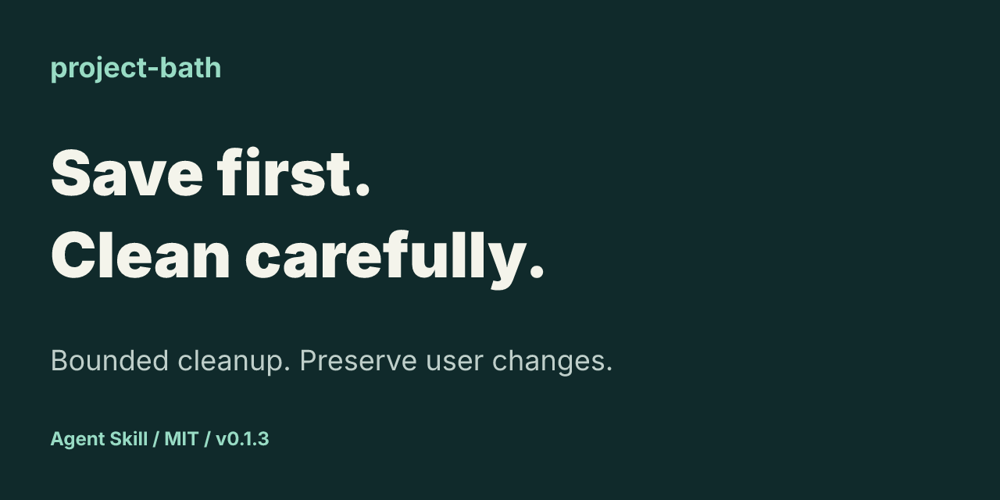

<p align="center"></p>

<h1 align="center">project-bath</h1>

<p align="center">给现有项目做一次有依据、可恢复的清理，保留有效规则和你的改动。</p>

项目做久了，失效代码、重复逻辑、旧注释和已经结束的上下文会留下噪声。project-bath 是交给 Agent 使用的清理 Skill：先查证、保存原件，再分批清理和验收。证据不足时保留内容，不为凑清理量制造改动。

## 什么时候用

适合你明确要求阶段性清理：检查死代码、行为等价的重复、过时 TODO/路径，或让已结束、错误的上下文退出活动入口。想先了解问题，选只读审计。

普通功能开发、架构重构不触发它。年代久不代表规则失效，零文本引用也不代表代码可以删除。

## 它怎样工作

[](https://qq2743759880.github.io/project-bath/)

**[Open Interactive Diagram](https://qq2743759880.github.io/project-bath/)** · [恢复与冲突交互图](https://qq2743759880.github.io/project-bath/recovery/) · [六秒 trace 动效](assets/workflow.webm)

范围确定 → 建立基线 → 找候选与判断证据 → 核对备份位置 → 保存原字节 → 清理一批 → 验收 → 交接。只读、证据不足、备份失败和新增失败走各自分支。图中节点可以查看原始规则、上下游和路径；浅色/深色及动效仅帮助阅读，不代表后台程序正在执行。

**正式清理前需要可写的 D 盘。** v0.1.3 统一备份到 `D:/project-bath/<项目目录>/<批次>/`。D 盘不可用或无写权限时，保留原件、停止本批并报告，不改用 C 盘或项目内归档。

## 安装到 Agent

下载 **[project-bath-v0.1.3-skill.zip](https://github.com/qq2743759880/project-bath/releases/download/v0.1.3/project-bath-v0.1.3-skill.zip)**，解压后只需这两个文件：

```text
project-bath/
├─ SKILL.md
└─ references/
   └─ LICENSE
```

实际安装的是 `SKILL.md` 中的完整方法，以及合法分发所需的原许可证。没有独立 CLI、自动清理程序或 Python/Node 运行依赖。

把整个 `project-bath/` 放入你的宿主 Agent 支持的 Skill 目录；宿主发现路径各不相同。也可以让能读取本机文件的 Agent 直接读取解压目录中的 `SKILL.md`。正式清理时，Agent 还需要在你授权的范围内读写文件，并能核验 D 盘备份。

若选择 `git clone https://github.com/qq2743759880/project-bath.git`，得到的是完整展示仓。README、图片、交互 HTML、图源和说明文档供人阅读，**不需要一起装进 Agent**；只复制上面列出的两个 Runtime 文件即可。

## 快速开始：选择你的任务

先让 Agent 读取安装目录的 `SKILL.md`，再选择下面一种请求。示例里的“当前项目”指你实际要处理的项目；范围、保留项和批次路径由你填写。这些是任务 Prompt，不是 shell 命令；清理结果取决于项目证据。

### 只读审计：先知道什么值得清理

```text
使用 project-bath，只读审计当前项目的代码和活动文档。
先从入口与文件名找候选，再检查真实引用和命中片段。
保护我的未提交改动、有效约束和失败证据，不写入项目、不创建归档。
在会话给出候选、依据、建议处置和证据不足的暂留项。
```

Agent 会按范围查候选、核对失效或等价证据；不会编辑项目、创建空归档或把零引用直接当作死代码。你得到的是会话中的候选清单及理由，可能也得到“没有足够证据需要清理”的结果。

### 正式清理：按证据逐批处理

```text
使用 project-bath，清理当前项目中有充分证据的失效代码和过时上下文。
先确认范围、保留项、已有改动与检查结果；保留我的未提交内容和有效规则。
在授权范围内，核验 D:/project-bath 下的项目归属和新批次，先保存原字节。
跨盘先复制并核对哈希，再完成移动；核验通过后，一批只处理一个问题。
D盘不可用或无写权限就保留原件、停止本批并报告，不换备份位置。
重跑受影响检查；新增失败只回退本轮。最后交接已清理项、暂留项和恢复位置。
```

Agent 会建基线、保存原件与批次清单、清理并验收；默认不会处理第三方代码、生成物、锁文件、公开 API 变更、迁移、依赖移除或架构拆分。你得到的是有依据的实际改动、检查结果，以及本批备份／补丁／恢复位置；没有改动时不建空归档。

### 恢复或冲突处理：找回本批原件

```text
使用 project-bath，按我指定批次的 manifest.json 恢复本轮改动。
只读取这批清单及其引用的原件，先核对项目根归属和当前目标与本轮后状态。
状态一致才直接恢复；后续有修改则比对本轮补丁并安全合并。
同名新文件不可覆盖；不能安全合并时保留两份和现状，说明冲突。
不要全局 reset/clean，不扫描旧归档。交接已恢复项、实际检查和剩余冲突。
```

Agent 会先核对归属和后状态，选择直接恢复或补丁合并；不会整文件覆盖后续用户内容。你得到恢复结果和剩余冲突说明，无法安全合并的内容会保留两份及当前状态。[查看恢复规则](docs/recovery.md)。

## 备份与恢复边界

项目目录固定为 `<项目名>-<规范化项目根绝对路径的SHA-256前8位>`：解析链接，统一斜杠和大小写；同一项目复用目录，清单记录根路径并核对归属。新批次不得重名覆盖，内部保留原相对路径，并检查授权范围、符号链接、路径逃逸与冲突。

备份保存的是当时工作区的实际原字节，**Git HEAD 不能替代未提交内容**。`manifest.json` 包含项目根路径、范围、原／备份路径、处置、前／后哈希（移走为 `absent`）、依据与检查；局部编辑另存仅含本轮改动的可逆补丁。跨盘先复制并核验哈希，再完成移动；失败保留原件。

验收还会检查公开行为、用户改动、旧事实是否退出实际加载、归档是否退出构建，以及原件能否回取。未知加载通道要明确说明；修改文件不会清空已经读入的对话，需要时保存已验证交接并使用新上下文。

## 文档与版本

| 你要做什么 | 入口 |
|---|---|
| 让 Agent 加载完整方法 | [原始 SKILL.md](SKILL.md) |
| 阅读流程、查看图源或离线交互图 | [流程说明](docs/workflow.md) |
| 按指定批次恢复与处理冲突 | [备份与恢复](docs/recovery.md) |
| 核对 Runtime、展示资产和原文来源 | [来源与分发说明](docs/source.md) |

当前 Skill 版本为 **v0.1.3**，按 [`MIT` 开源许可证](LICENSE) 发布；原始许可及全部版权声明保留在 [references/LICENSE](references/LICENSE)。交互展示的必要许可与字体声明见 [展示许可说明](references/archify/NOTICE.md)。
