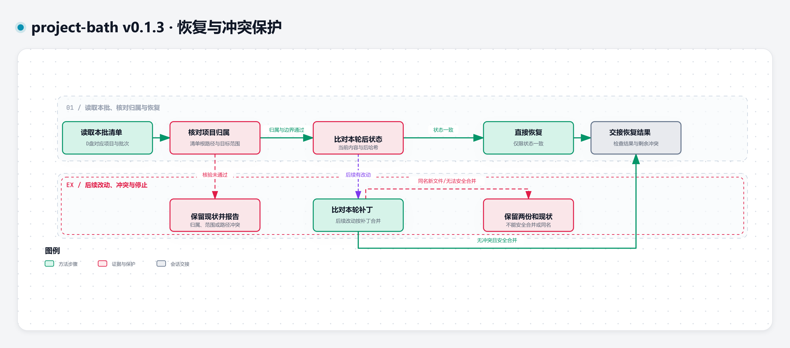

# v0.1.3 备份、恢复与冲突

[Open Interactive Recovery Diagram](https://qq2743759880.github.io/project-bath/recovery/)

## 先知道原件放在哪里

所有停用文件与编辑前备份统一放在 `D:/project-bath/<项目目录>/<批次>/`。项目目录为 `<项目名>-<规范化项目根绝对路径的SHA-256前8位>`，根路径解析链接并统一斜杠和大小写。同一项目复用同一目录，清单记录项目根并核对归属；批次不得重名覆盖，内部保留原相对路径。

D 盘不可用或无写权限时，保留原件、停止本批并报告，不改用 C 盘或项目内分散归档。跨盘先复制并核对哈希，再完成移动；失败保留原件。

整文件移入归档；局部编辑备份实际工作区原字节，不能用 Git HEAD 代替未提交内容。`manifest.json` 记录项目根路径、范围、原/备份路径、处置、前/后哈希（移走为 `absent`）、依据与检查；编辑另存仅含本轮改动的可逆补丁。无 Git 也保留备份和差异。

## 按指定批次恢复

1. 告诉 Agent 目标项目和本批 `manifest.json` 的实际位置。只读取清单及本批所需原件，不扫描旧归档。
2. 核对项目根归属、范围、原/目标路径、链接、路径逃逸和覆盖冲突。
3. 比对当前目标与本轮后状态：一致才直接恢复；后续有修改，则比对本轮补丁并安全合并。
4. 同名新文件不可覆盖；不能安全合并时，保留两份和现状并报告冲突。禁止全局 reset/clean 或整文件恢复覆盖后续用户内容。
5. 在会话交接已恢复项、实际检查与剩余冲突。不要把存在备份误当作“已经恢复”。

[回到三种使用请求](../README.md#快速开始选择你的任务) · [查看完整原始方法](../SKILL.md) · [恢复图源](../assets/diagram-source/recovery.json) · [离线恢复 HTML](recovery/index.html)
