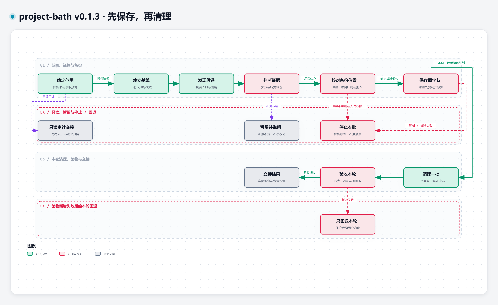

# v0.1.3 清理流程与交互阅读

[Open Interactive Diagram](https://qq2743759880.github.io/project-bath/) · [恢复交互图](https://qq2743759880.github.io/project-bath/recovery/)

图中步骤来自 [v0.1.3 原始 SKILL](../SKILL.md)。这是 Agent 执行的方法，不是运行中的自动清理系统。正常流程先查证，再核对备份落点、保存原件、清理与验收；例外路径保留只读、证据不足、D 盘不可用/无写权限、复制或核验失败、验收新增失败。

## 本版的关键条件

- 唯一备份位置为 `D:/project-bath/<项目目录>/<批次>/`；D 盘不可用或无写权限停止本批，不能更换落点。
- 项目目录为 `<项目名>-<规范化项目根绝对路径的SHA-256前8位>`；解析链接，统一斜杠和大小写，核对清单根归属。批次不得重名覆盖。
- 跨盘先复制并核验哈希，再完成移动；失败保留原件。
- 保存的是工作区实际原字节，清单记录项目根、范围、原/备份路径、处置、前后哈希、依据与检查；局部编辑保留本轮补丁。
- 新增失败只回退本轮；恢复先比对本轮后状态，后续改动不得被整文件覆盖。

## 交互与离线文件

点节点查看固定版本原文来源与关联关系；上下游只追踪编写的连接；路径选择两个节点，沿真实有向连接探索。透镜按方法角色筛选，演示模式用于讲解，Live/Still 控制 trace 阅读动效。

- [主流程 typed JSON](../assets/diagram-source/workflow.json) · [恢复 typed JSON](../assets/diagram-source/recovery.json)
- [自包含主流程 HTML](index.html) · [恢复 HTML](recovery/index.html)：clone 后在浏览器直接打开。
- [原生六秒 WebM](../assets/workflow.webm)：流程阅读动效，不是软件运行 Demo。
- [恢复与冲突说明](recovery.md) · [来源与分发边界](source.md)

这些文件属于 GitHub 展示面，不是安装到 Agent 的 Runtime。保留 editable JSON 供阅读和调整；完整构建工具、设计源、依赖锁和验收日志由维护者另行管理，未作为使用依赖发布。
