# 清理与交接流程

这是 Agent 遵循的清理方法，步骤与分支来自 [SKILL.md](../SKILL.md#执行)，不是独立自动化程序或部署架构。原执行第4步在图中拆成“保存”和“清理”，让写入前提更清楚。图表示一个有界批次；证据不足的候选暂留，不代表其他有证据的候选都不能处理。

[可编辑 Mermaid 源](../assets/workflow.mmd)。

| 图中内容 | 原文依据 |
|---|---|
| 定范围、只审计时零写入 | SKILL.md 执行1 |
| 已有改动、失败基线 | 执行2 |
| 入口、引用、候选证据与暂留 | 执行3、判断依据 |
| 先保存原字节、归档与路径核验 | 执行4、备份与恢复1–2 |
| 分批清理、不跨API/依赖/架构边界 | 执行4 |
| 重跑检查、实际加载排除、保护用户改动 | 执行5、备份与恢复3 |
| 新失败只回退本轮；恢复需比较后状态 | 执行5、备份与恢复4 |
| 会话交接、无改动不建空归档 | 执行6 |

图中的写入分支都受明确授权、路径安全和备份核验约束。未知加载通道应如实披露；`.gitignore` 本身不证明冷归档已退出搜索或构建。恢复有后续修改时要比对并安全合并，不能直接覆盖，详见 [恢复说明](recovery.md)。没有永久删除、自动清空归档或整仓 reset/clean 分支。
